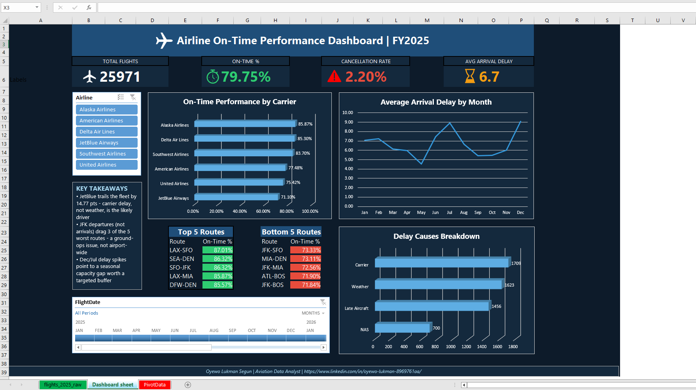

# Airline On-Time Performance Analytics — FY2025

A full-year (25,971-flight) on-time performance analysis, built in Excel as **Stage 1 of a
4-tool series** — Excel → SQL → Python → Power BI — solving the same business problem four
different ways to demonstrate multi-tool fluency.

## The business problem

Network Operations has no single view of where on-time performance breaks down — by carrier,
route, or root cause — so crew, de-icing, and gate-staffing investment gets decided on anecdote
instead of data. This dashboard gives leadership a reporting tool that shows exactly where delays
originate and which carriers/routes need intervention.

## The headline finding

**79.75%** fleet-wide on-time rate — but individual carriers range from **85.87%** down to
**71.10%**, a **14.77-point gap** on largely overlapping route networks. Full findings and
recommended actions: [`docs/05_business_recommendations.md`](docs/05_business_recommendations.md)

## Dashboard




## Repo structure

```
data/raw/       Immutable source data + the script that generated it
excel/          Finished workbook — AirlineOTP_Dashboard.xlsm
docs/           Every methodology decision, documented
```

## Documentation

| Doc | Covers |
|---|---|
| `docs/data_dictionary.md` | Schema, conventions, known data-quality issues |
| `docs/02_data_cleaning.md` | Power Query cleaning log |
| `docs/03_data_model.md` | Calculated column formulas + design notes |
| `docs/04_design_system.md` | Dashboard color palette + rationale |
| `docs/05_business_recommendations.md` | 4 findings, translated into action |

## Stack (Stage 1 of 4)

Excel · VBA (Macros) · Power Query · PivotTables · Slicers & Timelines · Conditional Formatting

SQL, Python, and Power BI versions of this same analysis are in progress.

## About

**Oyewo Lukman Segun** — Aviation Data Analyst
[linkedin.com/in/oyewo-lukman-segun](https://linkedin.com/in/oyewo-lukman)
